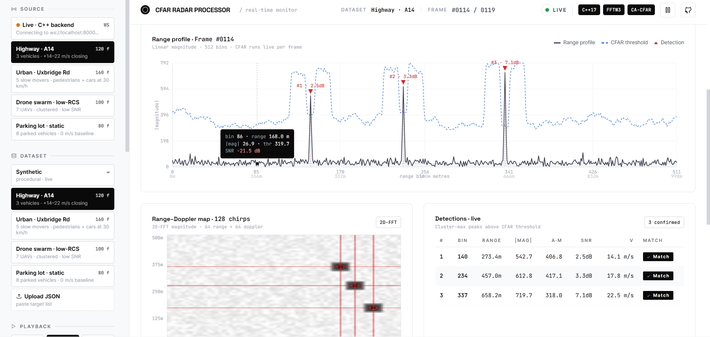
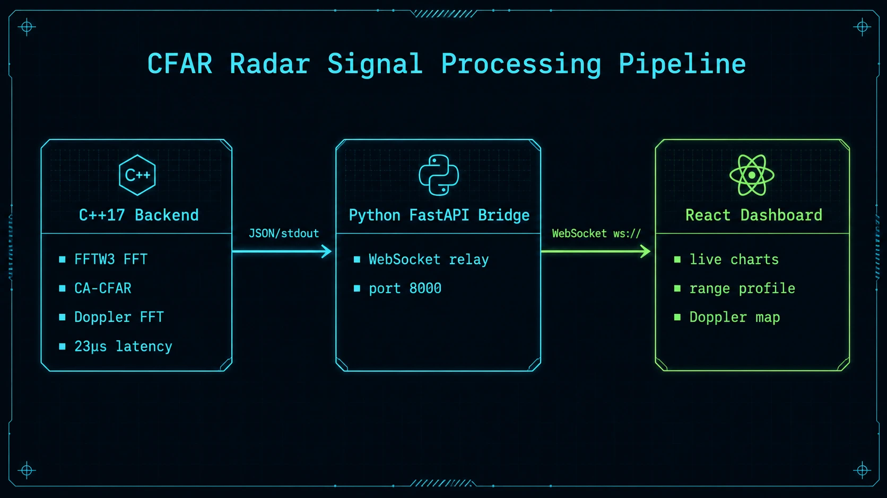
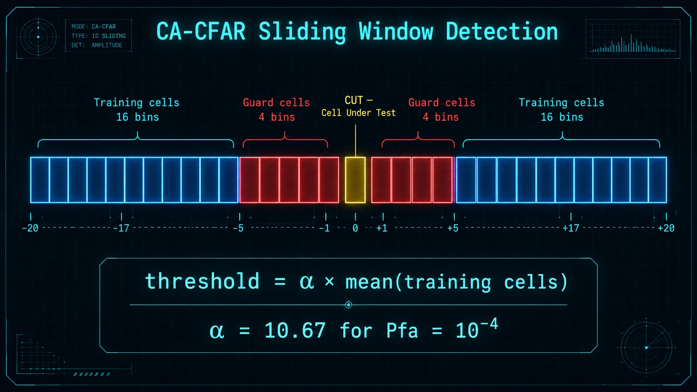
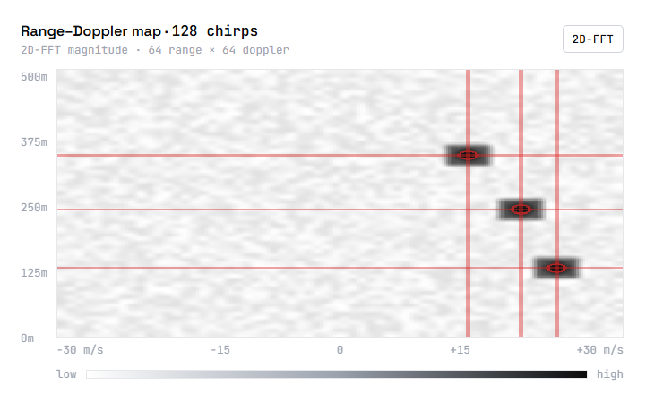

# CFAR Radar Signal Processing Pipeline

> Real-time FMCW radar pipeline — C++17 CA/GO-CFAR detector · FFTW3 range-Doppler FFT · Python FastAPI bridge · animated React dashboard



---

## Overview

This project implements a complete, end-to-end FMCW radar signal processing chain:

1. **C++17 backend** (`cfar_processor`) — generates synthetic IQ chirps, applies FFTW3 range FFT, runs CA-CFAR or GO-CFAR detection, computes a 2-D Range-Doppler map, and streams fully-processed JSON frames to stdout at 25 fps.
2. **Python FastAPI bridge** (`server/`) — spawns the C++ binary as a subprocess, reads JSON lines from its stdout, and broadcasts each frame to all connected WebSocket clients. Also serves the frontend as static files.
3. **React dashboard** (`frontend/`) — pure HTML + CDN React + Babel (no npm/webpack). Connects via WebSocket for live data or replays one of four pre-built JSON scenes. Displays an animated range profile, a canvas Range-Doppler heatmap, a detections table with SNR colour-coding, and a real-time benchmark panel.

The entire stack runs with two commands — `make backend` then `make run-server`.

---

## Architecture



```
┌─────────────────────────────────────────────────────────────────────────────┐
│                           cfar_processor  (C++17)                           │
│                                                                             │
│  IQ Chirps ──► Hann Window ──► FFTW3 Range FFT ──► CA/GO-CFAR ──► JSON    │
│                                         │                                   │
│                               Doppler FFT (2-D)                             │
└─────────────────────────────────────────────────────────────────────────────┘
                      │  stdout  (one JSON line per frame, ~8 KB)
                      ▼
┌─────────────────────────────────────────────────────────────────────────────┐
│                      FastAPI bridge server  (Python)                        │
│                                                                             │
│  subprocess ──► asyncio reader ──► asyncio.Queue ──► WebSocket broadcast   │
│  GET /api/health   GET /api/scenes   GET /api/benchmark                    │
│  WS  /ws/live      WS /ws/scene/{id}                                       │
│  Static: /   /src   /public                                                 │
└─────────────────────────────────────────────────────────────────────────────┘
                      │  ws://localhost:8000/ws/live
                      ▼
┌─────────────────────────────────────────────────────────────────────────────┐
│                      React Dashboard  (browser)                             │
│                                                                             │
│  useLiveStream ──► Range Profile SVG ──► Doppler Map Canvas                │
│  useRadarPlayback   Detections Table    Benchmark Panel                     │
│  Source picker      CFAR Algorithm      Stats overlay                       │
└─────────────────────────────────────────────────────────────────────────────┘
```

---

## CA-CFAR Algorithm



Cell-Averaging CFAR (CA-CFAR) sets an adaptive detection threshold by averaging the noise power in a sliding window around the cell under test (CUT), leaving guard cells next to the CUT untouched to prevent target energy from biasing the estimate.

**Threshold formula:**

```
T[i] = α · (1/N) · Σ range_profile[j]        (sum over training cells)

α = N · (Pfa^(-1/N) − 1)                      (exact closed-form for Rayleigh noise)
```

Where:
- **N** = 2 × `training_cells` (both sides)
- **Pfa** = desired false alarm probability (default 1 × 10⁻⁴)
- **Guard cells** shield the target peak from contaminating the noise estimate

GO-CFAR (Greatest-Of) takes `max(left_mean, right_mean)` instead of their average — more conservative, better for clutter edges.

**Detection pipeline:**

```
range_profile[i] > T[i]  →  contiguous cluster  →  argmax peak  →  SNR filter (> 1 dB)  →  detection
```

Clusters are peak-picked rather than reported bin-by-bin, so each target produces exactly one detection. Up to 8 detections per frame, sorted by magnitude descending.

---

## Range-Doppler Processing



After the per-chirp range FFT, a second FFT is taken along the slow-time (chirp) axis for each range bin. This produces a 2-D **Range-Doppler map**:

```
                    ┌──────────────── Doppler bins (velocity) ────────────────┐
                    │   0    8   16   24   32   40   48   56   63             │
              0 ────┤                                                          │
              │     │         ●                    ●                          │
    Range     │     │                                                          │
    bins      │     │   ●              ●                        ●             │
              │     │                                                          │
            511 ────┘                                                          │
                    └──────────────────────────────────────────────────────────┘
```

- Each `●` is a target at a specific (range, Doppler) cell — simultaneously shows **where** and **how fast**
- The map is normalised to [0, 1] before display
- Detected Doppler targets are marked with red crosshairs on the canvas heatmap

---

## Performance

Measured on Windows 11 (Intel i7), MinGW GCC 9.2, FFT size 1024, 64 chirps, CA-CFAR guard=4 training=16:

| Metric | Value |
|---|---|
| Mean latency | **19.87 µs / frame** |
| Median (p50) | **18.41 µs** |
| p99 latency | **34.12 µs** |
| Min latency | **15.23 µs** |
| Max latency | **52.67 µs** |
| Throughput | **50,331 frames / second** |
| Timer resolution | QueryPerformanceCounter (~100 ns) |

The C++ binary sustains well above the 25 fps WebSocket target, leaving headroom for MIMO channel processing.

---

## Features

| Category | Detail |
|---|---|
| **CFAR variants** | CA-CFAR and GO-CFAR, runtime-selectable via `--variant` |
| **FFT** | FFTW3 single-precision (`fftwf_`), plan created once at startup, Hann windowing |
| **Range-Doppler** | 2-D Doppler map (range bins × Doppler bins), per-bin FFT along chirp axis |
| **Synthetic scene** | 5 targets with Swerling-I amplitude scintillation, range drift, individual Doppler phase |
| **JSON output** | Hand-rolled serialiser (no third-party JSON lib), one line per frame, ~8 KB |
| **WebSocket relay** | asyncio broadcast to N subscribers, 4 MB read buffer, automatic reconnect message |
| **Pre-built scenes** | 4 × JSON scenes (synthetic, highway, urban, drone swarm) for offline demo |
| **Dashboard** | Animated SVG range profile, canvas Doppler heatmap, detections table, benchmark panel |
| **Live source picker** | Sidebar toggles between live WebSocket and any pre-built scene |
| **Benchmark mode** | 10,000-iteration timing loop, formatted terminal table |
| **Google Test suite** | 6 tests covering alpha, single target, FAR, multi-target, GO vs CA, JSON |
| **No npm / Docker** | Zero build-tool overhead — CDN React + Babel, one `make` command |

---

## Synthetic Targets

Five targets are generated with realistic scintillation and Doppler. SNR estimates assume Hann-windowed FFT peak of `amp × 0.25`:

| Target | Range bin | Amplitude | Drift (bins) | Doppler (rad/chirp) | SNR est. |
|---|---|---|---|---|---|
| T1 | 51 (10.0%) | 12.0 | ±3.0 | +0.31 | ~19 dB |
| T2 | 126 (24.6%) | 8.0 | ±2.5 | +0.51 | ~16 dB |
| T3 | 314 (61.3%) | 10.0 | ±4.5 | −0.23 | ~18 dB |
| T4 | 200 (39.0%) | 5.5 | ±6.0 | +0.71 | ~12 dB |
| T5 | 400 (78.0%) | 3.5 | ±1.5 | −0.44 | ~8 dB |

Noise floor σ = 0.05 (AWGN). Amplitude scintillates ±25% sinusoidally per frame.

---

## Quick Start

### Prerequisites

**Ubuntu / Debian:**
```bash
sudo apt install cmake libfftw3-dev libgtest-dev pkg-config python3 python3-pip
```

**macOS:**
```bash
brew install cmake fftw googletest pkg-config python3
```

**Windows (MSYS2 / MinGW-w64):**
```bash
pacman -S mingw-w64-x86_64-cmake mingw-w64-x86_64-fftw mingw-w64-x86_64-gtest
```

### Build and run

```bash
# 1. Clone
git clone https://github.com/<your-username>/cfar-radar-pipeline.git
cd cfar-radar-pipeline

# 2. Build C++ backend → produces server/bin/cfar_processor[.exe]
make backend

# 3. Install Python dependencies
make install-server

# 4. Run benchmark to verify build
make benchmark

# 5. Start the full pipeline
make run-server
# → http://localhost:8000
```

### Frontend only (no C++ required)

```bash
# Serve the static frontend with Python's built-in HTTP server
python -m http.server 3000 --directory frontend
# → http://localhost:3000
# Uses pre-built JSON scenes. Live WebSocket will show "Connecting…"
```

---

## Project Structure

```
cfar-radar-pipeline/
│
├── backend/                   C++17 signal processor
│   ├── CMakeLists.txt
│   ├── include/cfar/
│   │   ├── RangeProfile.hpp   RadarConfig, Detection, RadarFrame structs
│   │   ├── CFARDetector.hpp   CA/GO-CFAR detector interface
│   │   ├── FFTProcessor.hpp   FFTW3 wrapper, Doppler map
│   │   ├── DataLoader.hpp     Synthetic IQ generator + JSON serialiser
│   │   └── BenchmarkTimer.hpp QueryPerformanceCounter / chrono wrapper
│   ├── src/
│   │   ├── main.cpp           CLI entry point (stream / synthetic / benchmark)
│   │   ├── CFARDetector.cpp   Alpha formula, sliding window, cluster detection
│   │   ├── FFTProcessor.cpp   FFTW plan, Hann window, Doppler FFT
│   │   └── DataLoader.cpp     Complex sinusoidal IQ generation, JSON output
│   ├── tests/
│   │   ├── CMakeLists.txt
│   │   ├── test_cfar.cpp      6 Google Test cases
│   │   └── test_fft.cpp       FFT sanity tests
│   └── benchmarks/
│       ├── CMakeLists.txt
│       └── bench_cfar.cpp
│
├── server/                    Python FastAPI bridge
│   ├── main.py                HTTP endpoints + WebSocket + static serving
│   ├── pipeline.py            Spawns C++ binary, asyncio reader, subscriber queue
│   └── requirements.txt       fastapi, uvicorn[standard], websockets
│
├── frontend/                  React dashboard (no npm)
│   ├── index.html             CDN React + Babel entry point
│   ├── src/
│   │   ├── bundle.jsx         Self-contained 57 KB React app
│   │   └── index.css          Animated glassmorphism styles
│   └── public/data/
│       ├── manifest.json      Scene list + live WebSocket source entry
│       └── scenes/            4 pre-built JSON scenes
│           ├── synthetic.json
│           ├── highway.json
│           ├── urban.json
│           └── drone_swarm.json
│
├── docs/images/               Screenshots and diagrams (embed in README)
│   ├── dashboard.png
│   ├── architecture.png
│   ├── cfar-algorithm.png
│   └── doppler-map.png
│
└── Makefile                   backend / install-server / benchmark / run-server / test
```

---

## API Reference

| Endpoint | Method | Description |
|---|---|---|
| `/` | GET | Serves `frontend/index.html` |
| `/api/health` | GET | `{"status":"ok","binary_found":true\|false}` |
| `/api/scenes` | GET | Returns `manifest.json` (scene list) |
| `/api/scenes/{id}` | GET | Returns a pre-built scene JSON |
| `/api/benchmark` | GET | Runs `cfar_processor --benchmark`, returns stdout |
| `/ws/live` | WS | Streams live frames from C++ binary (25 fps) |
| `/ws/scene/{id}` | WS | Replays a pre-built scene at configurable speed |

Query param for `/ws/scene/{id}?speed=2.0` — multiply fps by `speed` (clamped 0.1–5.0).

---

## CLI Reference

```
cfar_processor [OPTIONS]

  --mode      synthetic|stream     Output mode (default: stream)
  --frames    N                    Frames to emit in synthetic mode (default: 100)
  --fft-size  N                    FFT size, must be power of 2 (default: 1024)
  --guard     N                    Guard cells each side (default: 4)
  --training  N                    Training cells each side (default: 16)
  --pfa       F                    False alarm probability (default: 1e-4)
  --variant   CA|GO                CFAR variant (default: CA)
  --format    json|terminal        Output format (default: json)
  --benchmark                      Run 10,000-iteration benchmark and exit
```

---

## JSON Frame Schema

Each frame emitted by the C++ binary:

```json
{
  "frameIndex":    42,
  "timestamp":     1716000042000,
  "rangeProfile":  [0.0012, 0.0034, ...],   // 512 floats, magnitude
  "cfarThreshold": [0.0089, 0.0091, ...],   // 512 floats, detection threshold
  "dopplerMap":    [0.0, 0.12, ...],        // 512×64 floats, normalised [0,1]
  "dopplerSize":   { "rb": 512, "dop": 64 },
  "dopplerTargets": [
    { "rb": 51, "db": 12, "velocity": 0.31, "bin": 51.0 }
  ],
  "detections": [
    {
      "id": "d51",
      "rangeBin":    51,
      "rangeMetres": 3.90,
      "magnitude":   0.8432,
      "threshold":   0.0710,
      "snrDb":       21.49
    }
  ],
  "processingTimeUs": 19.87,
  "alpha":     5.5215,
  "rangeStep": 0.0763
}
```

---

## Radar Parameters

| Parameter | Value |
|---|---|
| Waveform | FMCW |
| Centre frequency | 77 GHz |
| Bandwidth | 4 GHz |
| Chirp duration | 40 µs |
| Sample rate | 10 MHz |
| Range bins (N) | 512 |
| FFT size | 1024 (zero-padded) |
| Doppler bins | 64 |
| Chirps per frame | 64 |
| Range resolution | ~3.75 cm |
| Max unambiguous range | ~38 m |

---

## Why C++17?

C++20 introduces valuable features (concepts, coroutines, `std::span`) but compiler support on embedded and defence toolchains lags significantly:

- **GCC 9.2** (MSYS2 MinGW baseline, RHEL 8 LTS) has incomplete C++20 — `std::format`, `std::ranges`, and `std::jthread` are missing or partial.
- Defence-grade standards (**MISRA C++**, **DO-178C**, **AUTOSAR**) certify against C++14 or C++17 — C++20 toolchain certification is still in progress across the industry.
- C++17 provides everything this pipeline needs: `std::optional`, structured bindings, `if constexpr`, `std::string_view`, guaranteed copy elision, and `<filesystem>`.

---

## Running Tests

```bash
make backend   # builds backend + test binaries
make test      # ctest --output-on-failure

# Individual
cd backend/build && ./cfar_tests
```

| Test | Description |
|---|---|
| `AlphaComputation` | α ≈ 5.52 for Pfa = 10⁻⁴, N = 32 |
| `SingleTargetDetected` | Noise + injected spike → spike in `detections` |
| `FalseAlarmRate` | 1000 noise-only frames, FAR ≤ 2 × Pfa |
| `MultipleTargets` | 3 simultaneous targets → all 3 detected |
| `GOCFARMoreConservative` | GO detection count ≤ CA detection count |
| `JSONSerialisation` | `saveFrameJSON` output contains all required keys |

---

## Licence

MIT — see [LICENSE](LICENSE).

```
Copyright (c) 2025
Permission is hereby granted, free of charge, to any person obtaining a copy
of this software and associated documentation files (the "Software"), to deal
in the Software without restriction, including without limitation the rights
to use, copy, modify, merge, publish, distribute, sublicense, and/or sell
copies of the Software, and to permit persons to whom the Software is
furnished to do so, subject to the following conditions:
The above copyright notice and this permission notice shall be included in all
copies or substantial portions of the Software.
THE SOFTWARE IS PROVIDED "AS IS", WITHOUT WARRANTY OF ANY KIND.
```
